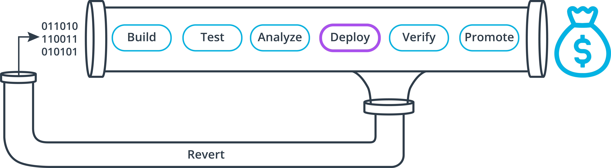

## What is Needed In This Job?

    1. An image that gets us ready to run Ansible.
    2. A filter to only run this job on master branch.
    3. Our ssh keys/key pair for our EC2 instance.
    4. Install the Ansible CLI in the job.
    5. An inventory file with the hostname or IP address of our EC2 instance in it.
    6. An Ansible playbook that configures the instance and copies files.
    7. A step that executes Ansible.
    8. A dependency in our workflow to make sure the infrastructure creation job finishes before this job runs.

    
      
    <h2>Deployment Going Smoothly!</h2>

In case you haven't added your SSH keys to Circle CI yet, check out these instructions in the doc to do that now.
